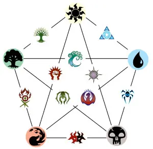

# Magic, L'Assemblée

[Accueil](README.md) | [Principe du jeu](PRINCIPE_DU_JEU.md) | [Les couleurs](COULEURS.md) | [Les différentes cartes](CARTES.md)

* **BLEU** – Le bleu est la couleur du contrôle. Elle met en avant l’évolution, l’anticipation est la sagesse et jouera des cartes de contre-sort pour empêcher l’adversaire de développer son plan de jeu.
* **NOIR** – L’intérêt personnel est au centre de cette couleur. Elle valorise la mort et le sacrifice des faibles pour permettre l’évolution des forts.
* **VERT** – L’harmonie est dans la nature et les choses sont telles qu’elles doivent être. La croissance et l’appel aux forces naturelles sont au centre de la couleur verte.
* **ROUGE** – Destruction et puissance sont au cœur du rouge. La force brute est l’arme de prédilection de cette couleur qui apprécie les forts et renie les faibles.
* **BLANC** – Le blanc prône la paix et l’ordre. C’est une couleur qui met en avant le collectif avant l’individualisme et qui jouera sur la puissance d’une armée structurée.

> Si vos decks peuvent être conçus autour d’une couleur pour marquer votre dévotion, ils peuvent aussi mélanger les styles pour favoriser les combinaisons. Les decks deux couleurs sont appelés des guildes. Il en existe 10 en tout. Si vous optez pour un deck trois couleurs, il s’agit alors d’un clan. Vous pouvez les retrouver sur notre présentation des guildes de Magic depuis cet article.

---
© Magic the Gathering | [Contact](contact.md)