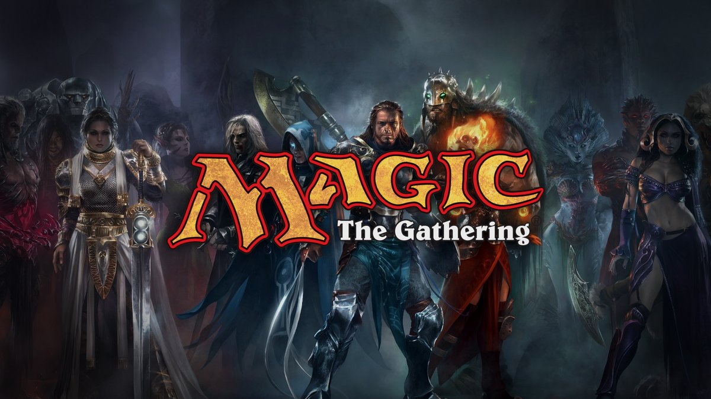

# Magic, L'Assemblée

[Accueil](README.md) | [Principe du jeu](PRINCIPE_DU_JEU.md) | [Les couleurs](COULEURS.md) | [Les différentes cartes](CARTES.md)

**Magic : L'Assemblée** *(Magic: The Gathering en anglais)* a été créé en 1993 par [Richard Garfield](https://fr.wikipedia.org/wiki/Richard_Garfield) un Américain passionné par Donjons et Dragons. Très tôt, il a en tête le concept de développer un jeu de cartes sans limite et en constante évolution. S’il test le jeu avec d’autres étudiant, Magic va prendre une ampleur planétaire grâce à la rencontre de Richard Garfield avec Peter Adkison qui travail pour le futur éditeur de Magic, Wizard of the Coast.

Aujourd’hui Magic propose plus de 20 000 cartes différentes réparties dans plus d’une centaine d’extensions différentes. Le jeu de cartes à collectionner regroupe des millions de joueurs à travers les cinq continents. Un succès qui n’est donc pas prêt de s’arrêter.

### Données clés

|Age|Mécanisme|Durée|Difficultés|
|:-----------:|:-----------:|:-----------:|:-----------:|
|A partir de 13 ans|Cartes|30 min|◻︎◻︎◻︎◼︎◼︎|

---
© Magic the Gathering | [Contact](mailto:reply@gmail.com)